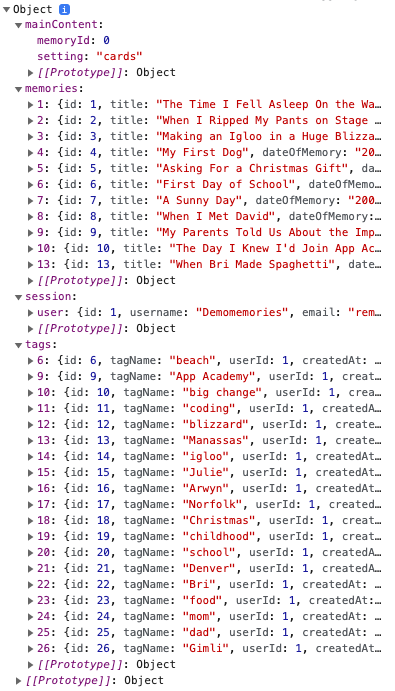

# Remembernote
- An app where a user can record their autobiography one memory at a time. 


- Deployed to Heroku: [Remembernote](remembernote-deux.herokuapp.com)

## Technology used
- React
- Redux
- Express
- PostgreSQL
- Sequelize
- AWS
- CKEditor (rich-text editor)
- ReactHTMLParser

## Index
- [Schema](https://github.com/ClifDevelops/Remembernote-Deux/wiki/Schema)
- [Feature List](https://github.com/ClifDevelops/Remembernote-Deux/wiki/Features)

## Features
- A user can record a memory, giving it a title, a date, a location, a rating, an image, and a story. The idea here is that a user might record a backlog of memories and store their autobiography over time. Here a rich-text editor called CKEditor5 is used to give the user some more control over how the memory's body is displayed. I've also implemented an AWS image bucket so a user can attach an image from their local machine. 


- All of the memories are shown on a user's homepage, and each can be viewed fully. These memories are filterable by title or date, with a more robust search option in the works.


- When a memory card is clicked, it shows the memory in the main component, along with a navigation on the right side of the display. 


- Each memory can be tagged, edited, and deleted via the navigation on the right side of the memory display. 


- On the home page navigation on the left, the user can click 'Display tags' to show all of the tags that the user has. If a particular tag is clicked, the memory cards displayed are filtered to only show the memories that correspond with that particular tag. In this case, only one memory corresponds to the tag 'choir'. 


## Some discussion on implementation
- I wanted to mostly render everything without changing pages, and for the most part I have gotten that to work out. Basically I have a homepage component which consists of the black navigation section on the left and the main component on the right, and I use Redux to keep track of state and choose what to display depending on that state. 
```bash
{mainContent === 'cards' || mainContent === undefined ? (
      <MemoryList searchTerm={searchTerm} />
      ) : 
      mainContent === 'editor' ?(
        <MemoryForm />
      ) : 
      mainContent === 'content' && memoryId !== 0 ? (
        <MemoryDisplay memoryId={memoryId} setTagsDisplay={setTagsDisplay}/>
      ) : null}
```
- This allowed me to minimize prop-threading, and it was really quite easy to set up once I realized I wanted to use Redux this way. 
- My Redux store currently consists of mainContent, memories, session, and tags. Each of these is an object that keeps track of a small section of the app, with mainContent just tracking what we should display in the main component, and memories and tags being objects that are normalized to the ids of their respective contents. 


## To-dos
- A thorough search function and/or better filtering options from the backend. 
- A brainstorm component that provides suggestions for memories to recall.
- A timeline that shows density of recorded memories at any particular date/year.